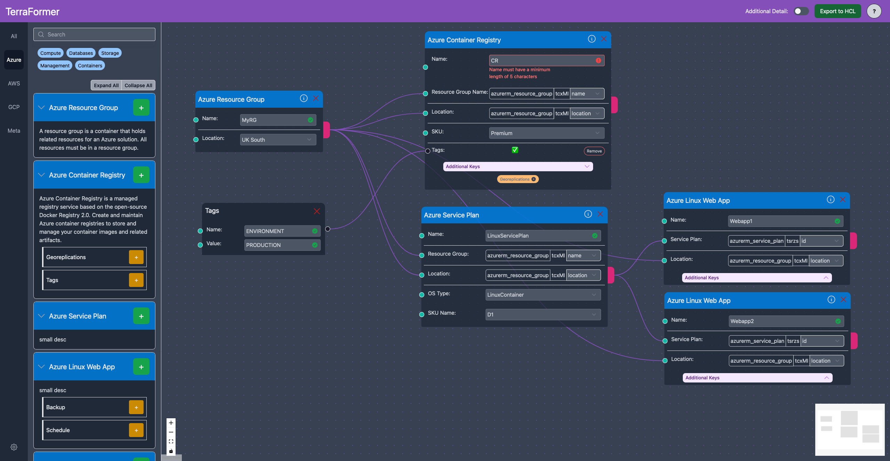
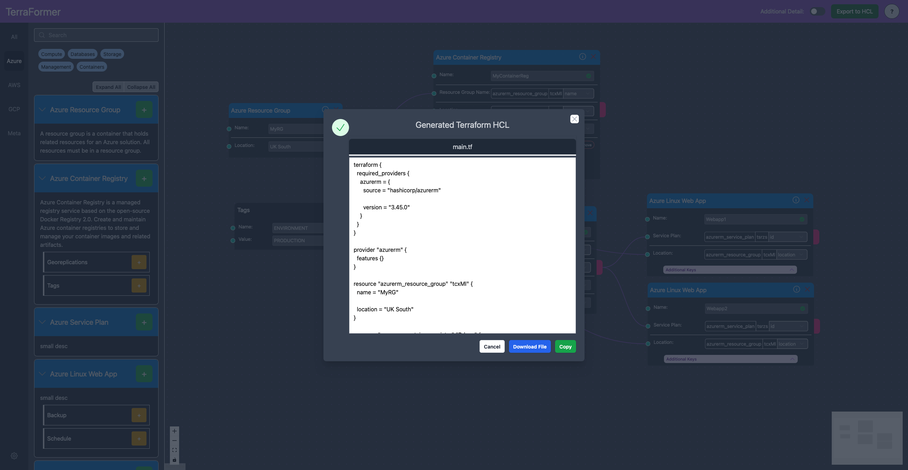
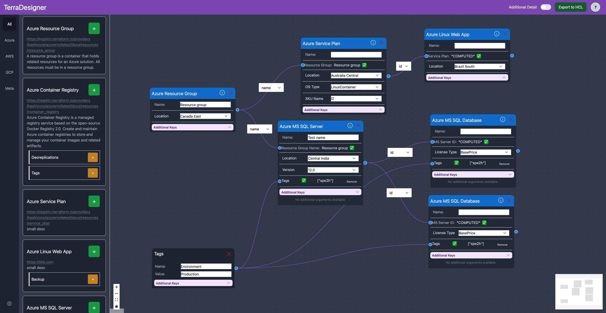
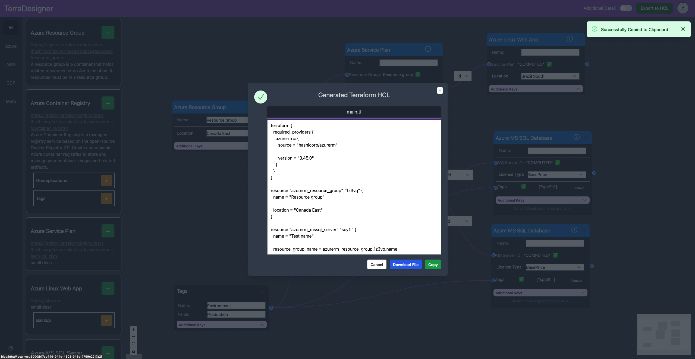

# FYP - TerraFormer

A Typescript React + Redux web app to automatically generate valid Terraform files through a more visual and accessible interface to improve the usability of Terraform.

Developed for my final year project which was graded at a 1st.

## Screenshots

Older Screenshots

## Report

The report for this can be found in `UP937683-FYP.pdf`.
